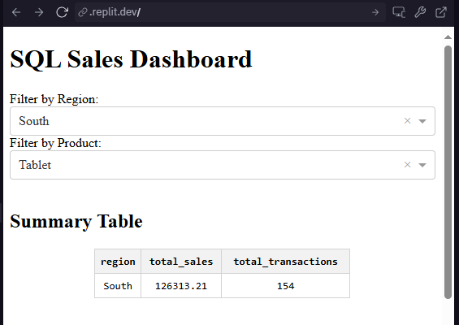
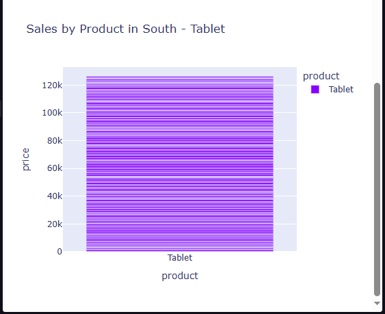

# SQL Sales Dashboard 📊

This is a simple yet powerful **Sales Dashboard** built using **Dash and Plotly**, with data sourced directly from an **SQLite database**. The app allows users to filter and explore sales data by **region** and **product**, view a **summary table**, and visualize the results through an interactive **bar chart**.

---

## 🔍 Features

- ✅ Connects to a local **SQLite database** (`sales.db`)
- ✅ Real-time **summary table** of total sales and transaction count by region
- ✅ Dynamic filtering by **region** and **product**
- ✅ Interactive **bar chart** for sales breakdown
- ✅ Built using **Dash**, **Plotly**, **Pandas**, and **Dash DataTable**

---

## 🖼️ Screenshots

### Filters + Summary Table  

### Interactive Bar Chart  

---

## 🛠️ Tech Stack

- Python 3
- Dash (by Plotly)
- Pandas
- SQLite3
- Dash DataTable

---

## 📂 How to Run

1. Clone the repository:
   git clone https://github.com/your-username/sql-sales-dashboard.git
   cd sql-sales-dashboard

2. Create a Virtual Environment (Optional but Recommended)
python -m venv venv
source venv/bin/activate       # On Windows: venv\Scripts\activate

3. Install Dependencies
pip install -r requirements.txt

4. Run the App
python app.py

## 💾 Database Information

Ensure that sales.db (included in the repo) is placed in the root folder. This file contains the sample sales data used to populate the dashboard.

## 📁 Project Structure

sql-sales-dashboard/
│
├── app.py                # Main Dash app
├── sales.db              # SQLite database file
├── screenshot.png        # Dashboard preview
├── requirements.txt      # Python dependencies
└── README.md             # Project documentation

## ✅ Use Case

This dashboard simulates a real-world sales report tool, demonstrating skills in:
Data filtering and transformation
Relational database integration
Business data visualization
Responsive and interactive UI with Dash

## 👤 Author

**Eric Mutisya**  
Python Developer & Web Automation Freelancer  
[View My GitHub Projects](https://github.com/Ek-Coder-Tech)

## 📢 License

This project is open for learning, practice, and demonstration purposes. Feel free to use or adapt it for your portfolio or freelance showcase.

## 🙌 Acknowledgments

Built as part of a hands-on learning path to demonstrate data handling, visualization, and dashboard creation using Python.

## 📬 Contact

For freelance inquiries, please reach out via [Upwork Profile](https://www.upwork.com/freelancers/~012558bab6232e8e65)